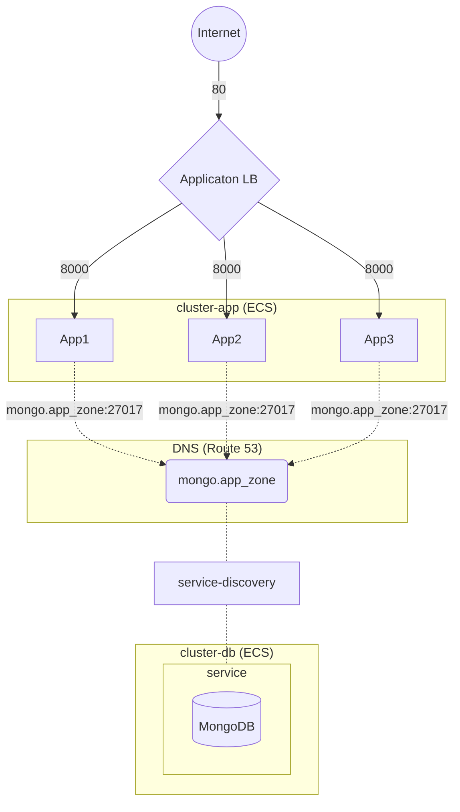

# simple-user-api showcase
This is a project created to showcase a simple python api running on AWS using ECS. The app implement api calls to upsert and get users on a MongoDB database. This is by no means intended for production usage.

The project is publicly available on https://github.com/gabrgomes/simple-user-api


## Very simplified diagram


## Running locally
Requirements:
- docker >= 20.10.18
  
```shell
# Building the app
docker compose build 

# run containers on background
docker compose up -d

# Api doc will be available on http://localhost:8000/docs

# stop the containers
docker compose down
```

## Running on AWS
Requirements:
- aws credentials configured ([ref](https://registry.terraform.io/providers/hashicorp/aws/latest/docs#authentication-and-configuration))
- terraform >= 1.3.2

```shell
# enter terraform directory
cd terraform

# install the requirements
terraform init

# see the modifications 
terraform plan

# provision application resources
terraform apply

# Api doc url will be shown on the output var app_url.

# remove application resources
terraform destroy
```

### Variables
| var | default  | description |
|---|---|---|
| region_name  | us-east-1  | AWS region name  |
|  app_name |  simple-user-api |  Name of the application to be used to create resources. |
|  app_image | public.ecr.aws/f9q5q0t9/simple-user-api:latest  | Application image url |
|  app_container_port |  8000 | Application port |
|  db_container_port |  27017 | MongoDB port |
|  max_capacity |  3 | Maximum number of application tasks |
|  min_capacity |  1 | Minimum number of application tasks |
|  cpu_threshold |  80 | Cpu % threshold for autoscaling |
|  mem_threshold |  80 | Memory % threshold for autoscaling |

### Considerations
For simplicity this project has some questionable choices that should be mentioned:
- The terraform module provision all resources on the default VPC.
- The database is implemented as simple MongoDB instance with no authentication and no persistence.
- The task definition is pointing to a image on a public repository that will eventualy stop working at any time. In this case you will need to build and publish the image to your own registry.
- The containers in ECS are configured with public IP adresses to allow image pull from public repositories. Ideally you could use private repos on ECR with the necessary security group configurations or use NAT for outgoing connections to the internet.


## Monitoring 
The terraform code creates a simple dashboard on Cloud Watch with cpu and memory usage for the services.


## TODO
- [x] App
- [x] Dockerfile
- [x] Docker compose
- [x] Deploy AWS
- [x] HA
- [x] Monitoring
- [x] Autoscaling
  
## Further improvements
- Create VPC and subnets
- [Use Internet gateway](https://engineering.finleap.com/posts/2020-02-20-ecs-fargate-terraform/)
- Create [pipeline](https://engineering.finleap.com/posts/2020-02-20-ecs-fargate-terraform/) to build image, push to ecr and update task definition
- Enable tracing with AWS Distro for OpenTelemetry
